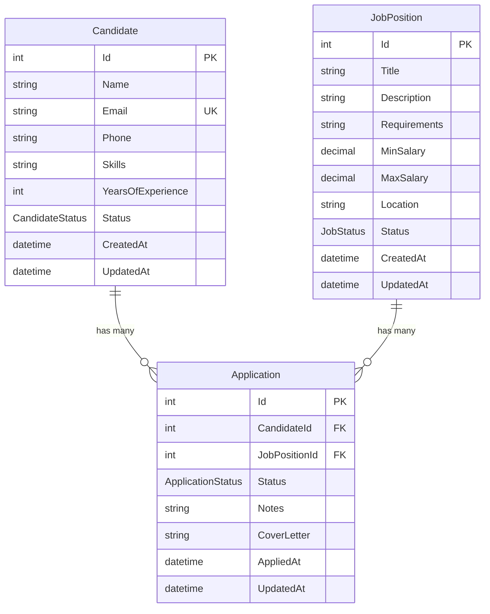
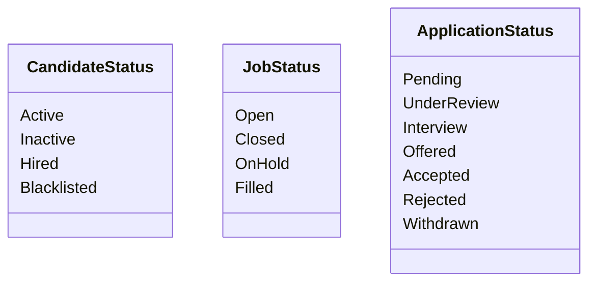

# TalentMatch - Plataforma de Selección de Talento

Sistema CRUD para gestión de procesos de reclutamiento con Entity Framework Core y PostgreSQL.

## 📋 Descripción

TalentMatch resuelve procesos lentos y poco precisos de reclutamiento mediante una plataforma con filtros inteligentes para gestionar candidatos, vacantes y aplicaciones.

## 🗃️ Diagrama de Entidades



## 📊 Enums de Estado



## 🛠️ Requisitos

- [.NET 8+ SDK](https://dotnet.microsoft.com/download)
- [Docker](https://www.docker.com/get-started)
- [Docker Compose](https://docs.docker.com/compose/install/)

## 🚀 Instalación y Ejecución

### 1. Iniciar la Base de Datos

```bash
# Desde la raíz del proyecto
docker-compose up -d
```

Esto iniciará PostgreSQL en `localhost:5432` con:
- **Usuario**: talentmatch
- **Contraseña**: talentmatch123
- **Base de datos**: talentmatch_db

### 2. Aplicar Migraciones

```bash
dotnet ef database update
```

### 3. Ejecutar la API

```bash
dotnet run
```

La API estará disponible en: `http://localhost:5000`

## 📖 Documentación API (OpenAPI)

Accede a la documentación OpenAPI en: `http://localhost:5000/openapi/v1.json`

## 🧪 Ejemplos de Pruebas CRUD

### Candidates

#### Crear candidato
```bash
curl -X POST http://localhost:5000/api/candidates \
  -H "Content-Type: application/json" \
  -d '{
    "name": "Juan Pérez",
    "email": "juan.perez@email.com",
    "phone": "+52 555 123 4567",
    "skills": "C#, .NET, SQL Server, Docker",
    "yearsOfExperience": 5,
    "status": "Active"
  }'
```

#### Listar candidatos
```bash
curl http://localhost:5000/api/candidates
```

#### Obtener candidato por ID
```bash
curl http://localhost:5000/api/candidates/1
```

#### Actualizar candidato
```bash
curl -X PUT http://localhost:5000/api/candidates/1 \
  -H "Content-Type: application/json" \
  -d '{
    "id": 1,
    "name": "Juan Pérez García",
    "email": "juan.perez@email.com",
    "phone": "+52 555 123 4567",
    "skills": "C#, .NET, SQL Server, Docker, Kubernetes",
    "yearsOfExperience": 6,
    "status": "Active"
  }'
```

#### Eliminar candidato
```bash
curl -X DELETE http://localhost:5000/api/candidates/1
```

### Job Positions

#### Crear vacante
```bash
curl -X POST http://localhost:5000/api/jobpositions \
  -H "Content-Type: application/json" \
  -d '{
    "title": "Senior .NET Developer",
    "description": "Desarrollador senior para proyectos enterprise",
    "requirements": "5+ años de experiencia en C#, Entity Framework, microservicios",
    "minSalary": 50000,
    "maxSalary": 80000,
    "location": "CDMX / Remoto",
    "status": "Open"
  }'
```

#### Listar vacantes
```bash
curl http://localhost:5000/api/jobpositions
```

#### Obtener vacante por ID
```bash
curl http://localhost:5000/api/jobpositions/1
```

#### Actualizar vacante
```bash
curl -X PUT http://localhost:5000/api/jobpositions/1 \
  -H "Content-Type: application/json" \
  -d '{
    "id": 1,
    "title": "Senior .NET Developer",
    "description": "Desarrollador senior para proyectos enterprise - URGENTE",
    "requirements": "5+ años de experiencia en C#, Entity Framework, microservicios",
    "minSalary": 55000,
    "maxSalary": 85000,
    "location": "CDMX / Remoto",
    "status": "Open"
  }'
```

#### Eliminar vacante
```bash
curl -X DELETE http://localhost:5000/api/jobpositions/1
```

### Applications

#### Crear aplicación
```bash
curl -X POST http://localhost:5000/api/applications \
  -H "Content-Type: application/json" \
  -d '{
    "candidateId": 1,
    "jobPositionId": 1,
    "status": "Pending",
    "coverLetter": "Me interesa mucho esta posición...",
    "notes": "Referido por empleado interno"
  }'
```

#### Listar aplicaciones
```bash
curl http://localhost:5000/api/applications
```

#### Obtener aplicaciones por candidato
```bash
curl http://localhost:5000/api/applications/candidate/1
```

#### Obtener aplicaciones por vacante
```bash
curl http://localhost:5000/api/applications/job/1
```

#### Actualizar estado de aplicación
```bash
curl -X PUT http://localhost:5000/api/applications/1 \
  -H "Content-Type: application/json" \
  -d '{
    "id": 1,
    "candidateId": 1,
    "jobPositionId": 1,
    "status": "Interview",
    "notes": "Pasó filtro técnico, agendar entrevista"
  }'
```

#### Eliminar aplicación
```bash
curl -X DELETE http://localhost:5000/api/applications/1
```

## 📁 Estructura del Proyecto

```
EntityFrameworkTest/
├── docker-compose.yml          # Configuración Docker PostgreSQL
├── README.md                   # Este archivo
└── TalentMatch/
    ├── Controllers/
    │   ├── ApplicationsController.cs
    │   ├── CandidatesController.cs
    │   └── JobPositionsController.cs
    ├── Data/
    │   └── TalentMatchContext.cs
    ├── Enums/
    │   ├── ApplicationStatus.cs
    │   ├── CandidateStatus.cs
    │   └── JobStatus.cs
    ├── Migrations/
    │   └── [timestamp]_InitialCreate.cs
    ├── Models/
    │   ├── Application.cs
    │   ├── Candidate.cs
    │   └── JobPosition.cs
    ├── Program.cs
    ├── appsettings.json
    └── TalentMatch.csproj
```

## 🔧 Comandos Útiles

```bash
# Crear nueva migración
dotnet ef migrations add NombreMigracion

# Aplicar migraciones
dotnet ef database update

# Revertir última migración
dotnet ef migrations remove

# Ver migraciones pendientes
dotnet ef migrations list

# Generar script SQL
dotnet ef migrations script

# Detener base de datos
docker-compose down

# Detener y eliminar volúmenes
docker-compose down -v
```

## 📝 Licencia

MIT License
